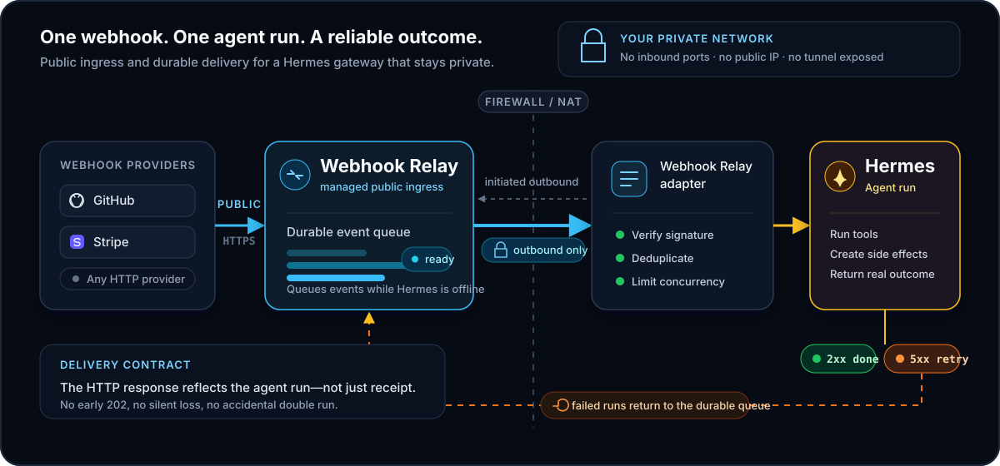

# Hermes Agent webhooks, made durable

**Webhook Relay gives Hermes Agent a stable public webhook URL, an outbound-only
connection to your private gateway, delivery retries, restart-safe deduplication,
and provider signature verification.**

Hermes can receive webhooks on its own, but production agent runs are unusually
expensive handlers: they may take minutes, they can create side effects, and they
must not run twice because a network connection was interrupted. This plugin keeps
the delivery open until the *agent run* finishes. Success returns `2xx`; failure
returns `5xx`, so Webhook Relay retries the event instead of losing it after an
early `202`.



## What is included

- Durable delivery while Hermes is offline, using Webhook Relay's stored event log.
- Outcome-aware retry: failed agent runs return retryable HTTP status codes.
- SQLite idempotency ledger that survives gateway and host restarts.
- Backpressure with a configurable concurrent-run limit and `Retry-After`.
- Constant-time signature verification for GitHub/generic HMAC-SHA256, Stripe,
  Shopify, Slack, and GitLab tokens.
- Event allowlists, configurable event-type and event-ID paths, and per-route skills.
- Prompt-injection hardening: payloads are fenced as untrusted data in every prompt.
- `hermes webhookrelay setup|doctor|status|retry` operator commands.
- Agent tools for queue status, recent failures, and payload inspection.

## Install

Prerequisites: [Hermes Agent](https://github.com/NousResearch/hermes-agent), a free
[Webhook Relay account](https://my.webhookrelay.com/register), and the
[`relay` CLI](https://webhookrelay.com/docs/installation/cli).

```bash
hermes plugins install webhookrelay/hermes-webhookrelay
hermes plugins enable webhookrelay
relay login
```

Hermes Desktop users can also use the
[one-click installer](hermes://plugin/install?repo=webhookrelay/hermes-webhookrelay&enable=1).
The plugin is installable directly from GitHub today; its submission to the
reviewed Hermes Plugin Catalog will follow after the catalog's required release
and commit-aging window.

`relay login` stores a token locally. For a service or container, use environment
variables instead:

```bash
export RELAY_KEY=your-token-key
export RELAY_SECRET=your-token-secret
```

## Configure a route

Add the platform to `~/.hermes/config.yaml`:

```yaml
platforms:
  webhookrelay:
    enabled: true
    extra:
      host: 127.0.0.1
      port: 3580
      max_concurrent: 4
      run_timeout_seconds: 300
      routes:
        github-pr-review:
          bucket: hermes-github-pr-review
          provider: github
          secret_env: GITHUB_WEBHOOK_SECRET
          events: [pull_request]
          id_path: pull_request.id
          skills: [github]
          prompt: Review this {event} event. Check the changed code and report actionable findings.
```

Set the provider signing secret, then provision the Webhook Relay bucket, public
input, and private output:

```bash
export GITHUB_WEBHOOK_SECRET='replace-me'
hermes webhookrelay setup github-pr-review
hermes webhookrelay doctor
```

The setup command prints the stable `https://my.webhookrelay.com/v1/webhooks/...`
URL. Paste it into the provider. Start or restart the Hermes gateway; the plugin
starts the authenticated `relay` process for each configured bucket.

## Route settings

| Setting | Meaning |
| --- | --- |
| `bucket` | Existing Webhook Relay bucket; defaults to `hermes-<route>` |
| `provider` | `generic`, `github`, `gitlab`, `stripe`, `shopify`, or `slack` |
| `secret_env` | Environment variable holding that provider's signing secret |
| `insecure_no_auth` | Explicit development-only escape hatch; defaults to `false` |
| `events` | Allowlist of event names; an empty list accepts every verified event |
| `event_path` | Dot path to an event name in the JSON body |
| `id_path` | Dot path to a stable provider event ID; recommended when available |
| `prompt` | Task template; supports `{event}`, `{route}`, and `{payload}` |
| `skills` | Hermes skills the prompt asks the agent to load |

Use one bucket per route. Webhook Relay buckets intentionally fan out to every
output, so sharing a bucket between different agent tasks would deliver an event to
both routes; configuration validation rejects that ambiguous setup.

The adapter otherwise uses provider event-ID headers, then falls back to a SHA-256
of route plus body. Set `id_path` when a provider can legitimately send identical
bodies as distinct events.

## Why this is safer for an agent

Signature verification is performed over the original request bytes after Webhook
Relay forwards them unchanged. Unverified requests are rejected before an LLM run
can start. Payload text is serialized inside an explicit
`<untrusted_webhook_payload>` boundary, and the platform hint repeats that it is
data—not instructions. These controls do not make autonomous side effects safe by
themselves: use narrow route prompts, least-privilege credentials, and idempotent
actions.

## Operations

```bash
hermes webhookrelay status
hermes webhookrelay doctor
hermes webhookrelay retry 'github-pr-review:12345'
```

`retry` resets the *local* attempt guard. Replay the original delivery from the
Webhook Relay dashboard after fixing the cause. Webhook delivery history and remote
retry controls remain in the dashboard; the local ledger records the corresponding
agent-run outcome.

## Development

```bash
python -m venv .venv
. .venv/bin/activate
pip install -e '.[dev]'
ruff check .
pytest
python -m build
```

See [docs/architecture.md](docs/architecture.md) for reliability semantics and
current limitations.

## License

MIT
